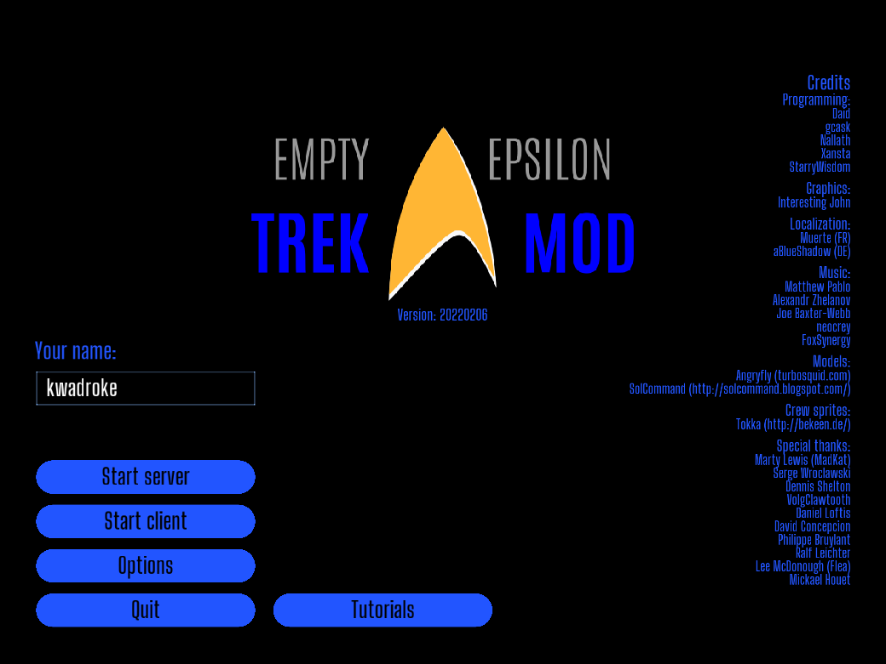
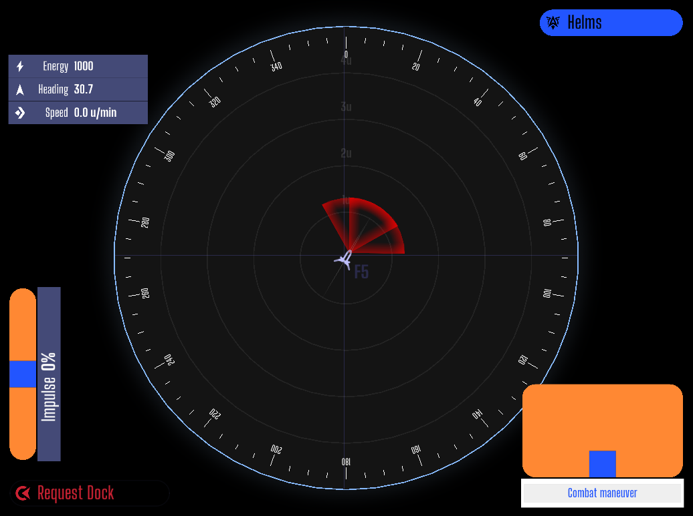

# EETrek

A Trek-like mod for [Empty Epsilon](https://daid.github.io/EmptyEpsilon/).

---

Place files in:  
Linux: `~/.emptyepsilon/resources/mods/eetrek`  
Windows: ??  
MacOS: ??  
Android: ??  

---

## Running the Mod

Edit _options.ini_ and change `mod=` to `mod=eetrek`  
OR  
Run `EmptyEpsilon mod=eetrek`

---

## Work in Progress

[See TODO for progress](TODO.md)

---

## Screenshots

GUI elements may change in future commits

